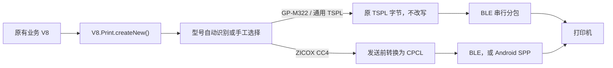

# 🧾 蓝牙打印机

吾码前端内置 `V8.Print` 蓝牙直连能力。业务 V8 只负责描述标签或小票，平台统一管理设备选择、连接恢复、型号识别、指令适配、分包与串行发送。目前重点兼容佳博 GP-M322 与 ZICOX CC4；原有佳博 V8 代码无需修改。

> **一份业务 V8，两种打印机协议**
>
> GP-M322 继续逐字节接收原有 TSPL；CC4 会在发送前把 `createNew()` 的标准 TSC 调用安全转换为厂家 CPCL。`createNewESC()` 生成的 ESC/POS 在两条路径上都保持原样。

## 先看结论

| 打印机 | 连接页型号 | 标签指令 | 传输 | 旧 V8 是否改动 |
|---|---|---|---|---|
| 佳博 GP-M322 | 自动识别或“佳博 GP-M322” | TSPL 原始字节 | BLE | 不需要 |
| ZICOX CC4 | 自动识别或“ZICOX CC4” | TSC 调用自动转换为 CPCL | BLE；Android 5+App 可回退到 SPP | 常用标准调用不需要 |
| 其它 TSPL 机型 | “其它 TSPL 打印机” | TSPL 原始字节 | BLE | 不需要 |

CC4 厂家资料声明支持 ESC/POS、CPCL、蓝牙双模及 Android/iOS 等平台。吾码只据此启用经过实现和测试的 ESC/POS、CPCL、BLE/SPP 路径，不把演示工程中出现但产品页未声明的 ZPL 当作 CC4 保证能力。型号参数以 [ZICOX CC4 官方页面](https://www.zicox.com/prod_Detail.aspx?id=73&tid=1) 与实际固件为准。

## 为什么旧 V8 可以保持不变



`createNew()` 仍返回原来的 TSC 构建器。运行时只在字节数组上记录不可枚举的高层操作元数据：

- GP-M322 和通用 TSPL 路径完全不读取这些操作，发送字节与改造前逐字节一致。
- CC4 路径在任何蓝牙写入发生前完成整份 CPCL 转换与校验。
- 无法安全映射的命令会让整次任务以“零写入”失败，不会先打印半张再报错。
- 对外方法名、参数和标准调用顺序保持不变，存量 V8 无需增加品牌判断。

不要对 `cmd.getData()` 做 `Array.from`、JSON 序列化或复制后再发送；这些操作会丢失 CC4 转换所需的不可枚举元数据。应直接把同一构建器返回的数组交给 `prepareSend`。

## 连接方式与平台边界

| 运行环境 | GP-M322 | CC4 | 说明 |
|---|---|---|---|
| Android 5+App | BLE | BLE 优先，SPP 兜底 | SPP 需先在 Android 系统蓝牙设置完成配对 |
| iOS 5+App | BLE | BLE | 不使用 Android RFCOMM/SPP |
| Chrome / Edge Web Bluetooth | BLE | BLE | 需要 HTTPS/localhost、用户手势与可识别的 BLE 服务 |
| 不支持 Web Bluetooth 的普通 H5 | 不可用 | 不可用 | `V8.Print` 可能存在，但连接页会明确提示 |
| 微信小程序原生蓝牙 | 独立实现 | 独立实现 | 不属于本页的 `Microi.Client` Web/5+App 链路 |

Android CC4 的经典蓝牙路径与厂家 Demo 保持一致：优先尝试 RFCOMM 通道 1，受系统限制时再尝试标准 SPP UUID `00001101-0000-1000-8000-00805F9B34FB`。吾码通过 5+ Runtime 的原生桥接访问该能力；实现原理可参考 [DCloud Native.js 文档](https://www.html5plus.org/doc/zh_cn/android.html)和[经典蓝牙 SPP 示例](https://ask.dcloud.net.cn/article/41162)。

Android 12 及以上版本在用户主动点击“搜索”时申请 `BLUETOOTH_SCAN` 与 `BLUETOOTH_CONNECT`，不会在页面加载或自动重连时突然弹窗。App 云打包/自定义基座还必须启用 DCloud Bluetooth 模块并在宿主清单声明相应权限；用户拒绝后，连接页会提示开启系统“附近的设备”权限。

Web 浏览器不能使用经典蓝牙 SPP。当前只申请常见打印机 BLE 服务 `18f0`、`ff00`、`49535343-fe7d-4ae5-8fa9-9fafd205e455`、`e7810a71-73ae-499d-8c15-faa9aef0c3f2`。如果某批 CC4 固件只开放 SPP 或使用其它私有 BLE UUID，应在 Android 5+App 使用已配对 SPP，或取得厂家准确 UUID 后扩展平台源码，不能猜测 UUID。

## 连接打印机

1. 打开打印机电源。Android 使用 CC4 经典蓝牙时，先到系统设置完成配对；Android 12+ 首次搜索允许“附近的设备”权限。
2. PC/平板点击顶部蓝牙图标；移动端进入【我的 → 蓝牙连接】。
3. 型号保持“自动识别（推荐）”。设备广播名没有 `ZICOX` 或 `CC4` 时，手工选择“ZICOX CC4”。
4. 点击搜索并选择设备。CC4 在 Android 中可选择带 `SPP` 标记的已配对设备。
5. 先执行“打印测试”，再进入业务模块打印真实标签。

型号选择与设备一起持久化。意外断线会有限次数自动重连；主动点击“断开连接”会停止重连并忘记设备。

## 旧 V8 的标准写法

下面代码同时用于 GP-M322 和 CC4，不需要增加品牌分支：

```javascript
function cleanPrintText(value, maxLength) {
  return String(value == null ? '' : value)
    .replace(/[\r\n"\x00-\x1f]/g, ' ')
    .slice(0, maxLength || 120);
}

async function printProductLabel(product) {
  if (!V8.Print) throw new Error('当前前端未加载蓝牙打印能力');

  if (!V8.Print.isConnected()) {
    var restored = await V8.Print.reconnect();
    if (!restored) restored = await V8.Print.OpenBluetoothPage();
    if (!restored || !V8.Print.isConnected()) {
      throw new Error('未连接蓝牙打印机');
    }
  }

  var cmd = V8.Print.createNew();
  cmd.setSize(60, 40);
  cmd.setGap(2);
  cmd.setSpeed(4);
  cmd.setDensity(8);
  cmd.setDirection(1);
  cmd.setCls();
  cmd.setText(20, 20, 'TSS24.BF2', 1, 1, cleanPrintText(product.Name, 40));
  cmd.setBarCode(20, 80, '128', 60, 1, 2, 4, cleanPrintText(product.Code, 40));
  cmd.setQR(340, 30, 'M', 5, 'A', cleanPrintText(product.Id, 120));
  cmd.setPagePrint();

  await V8.Print.prepareSend(cmd.getData());
  V8.Tips('打印数据已发送', true);
}
```

连接弹窗关闭后 `OpenBluetoothPage()` 才解析为 `Promise<boolean>`。首次 Web Bluetooth 选择必须由点击等用户手势直接触发。

## 型号与连接状态 API

旧业务不必调用型号 API。只有设备名称无法识别或需要诊断时才使用：

```javascript
// 查看当前解析出的型号配置
var profile = V8.Print.getPrinterProfile();
console.log(profile.id, profile.commandLanguage);

// 广播名无法识别时显式选 CC4；连接页也能完成同一操作
V8.Print.setPrinterProfile('zicox-cc4');

// 恢复按设备名自动识别
V8.Print.setPrinterProfile('auto');
```

`setPrinterProfile` 可用值为 `auto`、`gprinter-gp-m322`、`zicox-cc4`、`generic-tspl`。`getConnectionState()` 额外返回：

| 字段 | 含义 |
|---|---|
| `transport` | 当前 `ble` 或 `spp` 通道 |
| `profileMode` | 自动或手工选择值 |
| `profileId` / `profileName` | 最终生效的型号配置 |
| `commandLanguage` | 当前标签指令 `tspl` 或 `cpcl` |

打印前仍以 `isConnected()` 和 `prepareSend()` 为准，不以已保存的 `deviceId` 或状态快照代替实时连接判断。

## CC4 自动转换范围

| 处理方式 | TSC 方法 |
|---|---|
| 安全转换 | `setSize`、`setSpeed`、`setDensity`、`setGap`、`setBline`、`setFeed`、`setBackFeed`、`setDirection(0/1)`、`setReference`、`setBar`、`setBox`、`setReverse`、`setText`、`setQR`、`setBarCode`、`setBitmap`、`setPagePrint` |
| 构建时无需输出 | `init`、`setCls` |
| 写入前拒绝 | `addCommand`、`setCountry`、`setCodepage`、`setFromfeed`、`setHome`、`setSound`、`setLimitfeed`、`setErase` 及未知方法 |

CC4 每份自动转换的标签必须且只能调用一次 `setPagePrint()`。被拒绝的方法不是“打印机一定不支持”，而是当前平台没有足够证据保证 TSC 与 CPCL 语义等价；失败关闭比发送乱码更安全。确有需求时，应依据该型号 CPCL 手册补充映射和自动化/实机回归，再扩大白名单。

CC4 官方也支持 ESC/POS。使用 `createNewESC()` 时平台不做 TSC→CPCL 转换，原始 ESC/POS 字节直接发送。

## 批量与失败恢复

```javascript
for (var i = 0; i < rows.length; i++) {
  try {
    await printProductLabel(rows[i]);
  } catch (error) {
    V8.Tips('第 ' + (i + 1) + ' 张发送失败：' + (error.message || error), false);
    break;
  }
}
```

- 所有前端 V8 共用一个 `V8.Print` 单例和一条发送队列，仍应逐张 `await`。
- 不用 `Promise.all` 向一台打印机并发发送，也不用固定 `setTimeout` 猜测走纸完成。
- `prepareSend` 成功只证明字节写入 BLE/SPP 输出流，不代表已走纸、无缺纸或物理打印成功。
- 业务落库与打印不是原子事务。保存稳定业务单号和失败位置，由用户确认是否重打。
- 不支持的 CC4 命令、空数据和非法包长会在首个蓝牙写入前失败。

## 实机验收清单

上线前分别记录 GP-M322 与 CC4 的型号、固件、纸张、终端版本和连接通道，并覆盖：

1. 首次授权/配对、自动识别、手工选型、刷新恢复、主动断开和意外重连。
2. 中文、数字、长文本、条码、二维码、图片、正反方向、间隙纸与黑标纸。
3. 默认 20 字节与实测包长，特别覆盖数据长度恰好整除包长。
4. 两台打印机交替选择后，GP-M322 仍接收原 TSPL，CC4 接收 CPCL/ESC-POS。
5. 连续 20 张严格串行发送；中途关机、缺纸、离开范围和权限撤销后的失败位置。
6. CC4 Android BLE 与已配对 SPP；Web 端只验证固件真实开放的 BLE 服务。

没有目标打印机在场时，自动化测试只能证明协议转换、原字节回归、分包队列和连接状态逻辑，不能代替纸张、字库、浓度、偏移、传感器与物理走纸验收。

## 与打印引擎的边界

- [打印引擎](/doc/system-engine/print-engine)负责 `mic_print`、`PageObj`、`PrintObj`、A4/PDF/浏览器模板和在线设计。
- 蓝牙打印机负责 TSC/TSPL、CPCL、ESC/POS 原生命令以及近场设备连接。
- 完整前端 API、构建器方法和批量恢复见 [V8 客户端函数：蓝牙打印](/doc/v8-engine/v8-client#蓝牙打印-v8print)。

两者可以共享同一份业务数据，但模板 JSON 不能直接传给 `prepareSend`，打印机原始字节也不能当作 `PageObj`。
