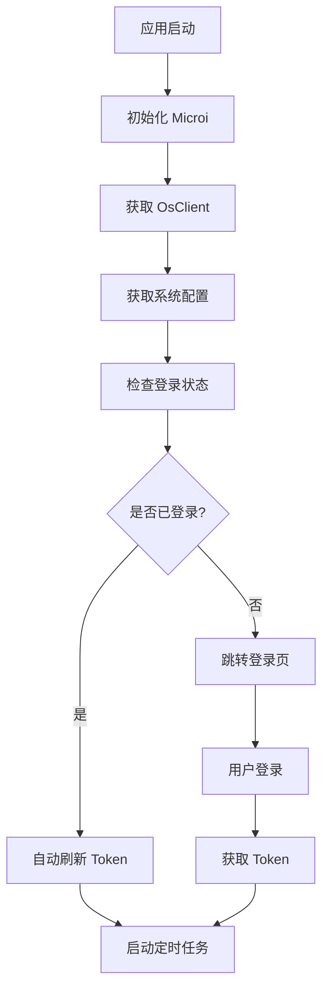

# 登录鉴权系统技术文档

## 项目概述

本项目基于 **Microi 低代码平台** 构建的 uni-app 应用，采用 JWT Token 认证机制，支持多种登录方式和客户端标识管理。

## 目录

- [1. 系统架构](#1-系统架构)
- [2. Token 管理机制](#2-token-管理机制)
- [3. 登录方式](#3-登录方式)
- [4. 客户端标识 (OsClient)](#4-客户端标识-osclient)
- [5. 验证码系统](#5-验证码系统)
- [6. API 接口文档](#6-api-接口文档)
- [7. 安全机制](#7-安全机制)
- [8. 初始化流程](#8-初始化流程)

## 1. 系统架构

### 1.1 核心组件

- **Microi 对象**：全局认证管理对象
- **Token 存储**：基于 uni-app 本地存储
- **自动刷新**：定时检查和刷新 token
- **多端支持**：支持 H5、APP、小程序等平台

### 1.2 认证流程



## 2. Token 管理机制

### 2.1 Token 获取

Token 通过 **HTTP 响应头** 返回，前端自动提取：

```javascript
// 位置：config/microi.uniapp.js
let token = res.header.Authorization || res.header.authorization
if(token){
    Microi.SetToken(token)
}
```

### 2.2 Token 存储

```javascript
// 存储位置：uni.setStorageSync
SetToken: function(token){
    uni.setStorageSync("Token", token);
    if(!token){
        uni.setStorageSync("TokenExpires", '');
    }else{
        // 设置过期时间为15分钟后（服务器为20分钟，最后5分钟会以旧换新）
        uni.setStorageSync("TokenExpires", new Date().AddTime('m', 15).Format('yyyy-MM-dd HH:mm:ss'));
    }
}
```

### 2.3 Token 自动刷新

**刷新策略**：
- 服务器 token 有效期：20 分钟
- 客户端设置过期时间：15 分钟
- 提前 5 分钟自动刷新
- 检查频率：每 1 分钟

```javascript
// 定时刷新逻辑
setInterval(function(){
    Microi.RefreshToken(param && param.TokenCallback);
}, 1000 * 60)
```

### 2.4 Token 验证

所有 API 请求自动携带 token：

```javascript
var header = {
    'content-type': 'application/json',
    authorization: 'Bearer ' + Microi.GetToken(),
    osclient: Microi.OsClient,
    clienttype: Microi.ClientType,
    clientsystem: Microi.ClientSystem
};
```

## 3. 登录方式

### 3.1 账号密码登录

**接口地址**：`POST /api/SysUser/login`

**请求参数**：
```javascript
{
    Account: "用户名",
    Pwd: "密码",
    _CaptchaId: "验证码ID",      // 可选
    _CaptchaValue: "验证码值"    // 可选
}
```

**响应头**：
```
authorization: eyJhbGciOiJIUzI1NiIsInR5cCI6IkpXVCJ9...
osclient: test
```

**实现代码**：
```javascript
// 位置：pages/mine/login/login.vue
Microi.Login({
    Account: res.account,
    Pwd: res.password,
    _CaptchaId: valiFormData.value._CaptchaId,
    _CaptchaValue: valiFormData.value.code
})
```

### 3.2 飞书登录

**接口地址**：`POST /api/ApiEngine/run`

**请求参数**：
```javascript
{
    ApiKey: "feishu_login",
    Data: {
        code: "飞书授权码",
        appKey: "飞书应用Key"
    }
}
```

**响应数据**：
```javascript
{
    Code: 1,
    Data: {
        CurrentUser: { /* 用户信息 */ },
        Token: "JWT_TOKEN"
    }
}
```

**实现代码**：
```javascript
// 位置：App.vue
Microi.ApiEngine.Run('feishu_login', {
    code: queryParams.code,
    appKey: queryParams.AppKey
}).then(res => {
    if (res.Code == 1) {
        Microi.SetCurrentUser(res.Data.CurrentUser);
        Microi.SetToken(res.Data.Token);
    }
})
```

### 3.3 Token 直接登录

**接口地址**：`POST /api/SysUser/TokenLogin`

**请求参数**：
```javascript
{
    _token: "JWT_TOKEN",
    Token: "JWT_TOKEN",
    TokenName: "token",
    OsClient: "客户端标识"
}
```

**请求头**：
```
authorization: Bearer JWT_TOKEN
```

**实现代码**：
```javascript
// 位置：App.vue
Microi.Post(getApiUrl('TokenLogin'), {
    _token: queryParams.token,
    Token: queryParams.token,
    TokenName: 'token',
    OsClient: Microi.OsClient
}, function(res){
    Microi.SetToken(queryParams.token);
    Microi.SetCurrentUser(res.Data);
})
```

## 4. 客户端标识 (OsClient)

### 4.1 OsClient 作用

- **区分客户端类型**：不同客户端使用不同的配置
- **API 路由**：根据 OsClient 选择不同的 API 服务器
- **权限控制**：不同客户端可能有不同的功能权限

### 4.2 OsClient 获取方式

#### 4.2.1 URL 参数方式

```
https://example.com?OsClient=loctek
```

```javascript
// 位置：App.vue
if (queryParams && queryParams.OsClient) {
    if (configOsClient && configOsClient[queryParams.OsClient]) {
        uni.setStorageSync('ApiBase', configOsClient[queryParams.OsClient]);
        uni.setStorageSync('OsClient', queryParams.OsClient);
    }
}
```

#### 4.2.2 域名识别方式 (H5)

支持域名格式：`{osclient}-m.{domain}`

```
https://loctek-m.example.com
```

```javascript
// 位置：App.vue
const domainPattern = /^([a-zA-Z0-9-]+)-m\.(.+)$/;
if (domainPattern.test(domain)) {
    const osClientMatch = domain.match(/^([a-zA-Z0-9-]+)-m\.(.+)$/);
    if (osClientMatch) {
        const osClient = osClientMatch[1];
        const apiBase = `${protocol}://api.${osClientMatch[2]}`;
        uni.setStorageSync('OsClient', osClient);
        uni.setStorageSync('ApiBase', apiBase);
    }
}
```

#### 4.2.3 服务器接口方式

**接口地址**：`POST /api/Os/GetOsClientByDomain`

**请求参数**：
```javascript
{
    Domain: "example.com"
}
```

**响应数据**：
```javascript
{
    Code: 1,
    Data: {
        OsClient: "loctek"
    }
}
```

### 4.3 客户端配置

**配置文件**：`static/config/index.js`

```javascript
var configOsClient = {
    apibase: 'https://api-china.itdos.com',           // 默认配置
    loctek: 'https://lowcode-center-api.loctek.com',  // 乐歌配置
    dahongcrm: 'http://121.41.225.44:1012'            // 大红CRM配置
}
```

### 4.4 OsClient 在请求中的使用

```javascript
// 请求头中携带
var header = {
    authorization: 'Bearer ' + Microi.GetToken(),
    osclient: Microi.OsClient,
    clienttype: Microi.ClientType,
    clientsystem: Microi.ClientSystem
};

// 请求参数中携带
Data.OsClient = Microi.OsClient;
```

## 5. 验证码系统

### 5.1 获取验证码

**接口地址**：`POST /api/Captcha/getCaptcha`

**请求参数**：
```javascript
{
    OsClient: "客户端标识"
}
```

**响应数据**：
```javascript
{
    Code: 1,
    CaptchaSrc: "data:image/png;base64,iVBORw0KGgoAAAANSUhEUgAA...",
    CaptchaId: "验证码唯一标识"
}
```

**实现代码**：
```javascript
// 位置：pages/mine/login/login.vue
const GetCaptcha = () => {
    Microi.GetCaptcha().then(res => {
        valiFormData.value._CaptchaSrc = res.CaptchaSrc;
        valiFormData.value._CaptchaId = res.CaptchaId;
    })
}
```

### 5.2 验证码配置

验证码是否启用由系统配置控制：

```javascript
// 系统配置中
{
    EnableCaptcha: 1  // 1-启用，0-禁用
}
```

### 5.3 登录时验证码验证

```javascript
// 登录请求中包含验证码信息
Microi.Login({
    Account: res.account,
    Pwd: res.password,
    _CaptchaId: valiFormData.value._CaptchaId,
    _CaptchaValue: valiFormData.value.code
})
```

## 6. API 接口文档

### 6.1 认证相关接口

| 接口名称 | 请求方法 | 接口地址 | 说明 |
|---------|---------|---------|------|
| 用户登录 | POST | `/api/SysUser/login` | 账号密码登录 |
| Token登录 | POST | `/api/SysUser/TokenLogin` | 直接使用Token登录 |
| 刷新Token | POST | `/api/SysUser/refreshToken` | 刷新过期Token |
| 获取用户信息 | POST | `/api/SysUser/getCurrentUser` | 获取当前登录用户信息 |
| 飞书登录 | POST | `/api/ApiEngine/run` | 飞书第三方登录 |

### 6.2 系统配置接口

| 接口名称 | 请求方法 | 接口地址 | 说明 |
|---------|---------|---------|------|
| 获取系统配置 | POST | `/api/DiyTable/getSysConfig` | 获取系统设置信息 |
| 获取客户端标识 | POST | `/api/Os/GetOsClientByDomain` | 根据域名获取OsClient |

### 6.3 验证码接口

| 接口名称 | 请求方法 | 接口地址 | 说明 |
|---------|---------|---------|------|
| 获取验证码 | POST | `/api/Captcha/getCaptcha` | 获取登录验证码 |

### 6.4 通用接口

| 接口名称 | 请求方法 | 接口地址 | 说明 |
|---------|---------|---------|------|
| 获取服务器时间 | POST | `/api/os/getDateTimeNow` | 获取服务器当前时间 |
| 添加系统日志 | POST | `/api/SysLog/addSysLog` | 记录系统日志 |

## 7. 安全机制

### 7.1 Token 安全

- **JWT 标准**：使用标准的 JWT Token 格式
- **自动过期**：Token 具有明确的过期时间
- **自动刷新**：提前 5 分钟自动刷新，避免中断
- **多端隔离**：不同客户端使用不同的 Token

### 7.2 请求安全

- **HTTPS 传输**：所有 API 请求使用 HTTPS
- **请求头认证**：每个请求都携带 Bearer Token
- **客户端标识**：通过 OsClient 区分客户端类型
- **参数加密**：敏感参数可进行加密传输

### 7.3 验证码安全

- **图形验证码**：防止暴力破解
- **时效性**：验证码具有时效性
- **随机性**：每次获取都是新的验证码

### 7.4 权限控制

- **角色权限**：基于角色的权限控制
- **接口权限**：不同接口需要不同权限
- **数据权限**：用户只能访问授权数据

## 8. 初始化流程

### 8.1 应用启动流程

```javascript
// 位置：App.vue onLaunch
onLaunch: async function() {
    // 1. 获取URL参数
    let queryParams = getQueryParams();
    
    // 2. 设置客户端类型和API地址
    if (queryParams && queryParams.OsClient) {
        uni.setStorageSync('OsClient', queryParams.OsClient);
        uni.setStorageSync('ApiBase', configOsClient[queryParams.OsClient]);
    }
    
    // 3. 处理特殊登录方式
    if (queryParams && queryParams.code) {
        // 飞书登录
    } else if (queryParams && queryParams.token) {
        // Token直接登录
    }
    
    // 4. 初始化Microi
    Microi.Init({
        TokenCallback: function() {
            // 登录状态回调
        }
    });
}
```

### 8.2 Microi 初始化流程

```javascript
// 位置：config/microi.uniapp.js Init方法
Init: async function(param) {
    // 1. 设置客户端类型
    Microi.ClientType = Microi.GetClientType();
    Microi.ClientSystem = Microi.GetClientSystem();
    
    // 2. 获取系统配置
    await Microi.GetSysConfig(true);
    
    // 3. 自动登录（token以旧换新）
    await Microi.RefreshToken(param && param.TokenCallback);
    
    // 4. 获取当前登录用户身份信息
    Microi.GetCurrentUser(true, param && param.TokenCallback);
    
    // 5. 启动定时任务
    setInterval(function() {
        Microi.RefreshToken(param && param.TokenCallback);
    }, 1000 * 60);  // 每1分钟检查token
    
    setInterval(function() {
        Microi.GetCurrentUser(true, param && param.TokenCallback);
    }, 1000 * 60 * 5);  // 每5分钟更新用户信息
    
    // 6. 获取服务器时间
    Microi.InitDateTimeNow();
}
```

### 8.3 登录页面初始化

```javascript
// 位置：pages/mine/login/login.vue
if (!Microi.SysConfig || Object.keys(Microi.SysConfig).length === 0) {
    Microi.Init({
        TokenCallback: function() {
            SysConfig.value = Microi.SysConfig;
            if (SysConfig.value.EnableCaptcha == 1) {
                GetCaptcha();  // 获取验证码
            }
        }
    });
}
```

## 9. 错误处理

### 9.1 登录失败处理

```javascript
if (res.Code == 1) {
    // 登录成功
    Microi.Tips('登录成功');
    // 跳转到首页
} else {
    // 登录失败
    if (SysConfig.value.EnableCaptcha == 1) {
        GetCaptcha();  // 重新获取验证码
    }
    Microi.Tips(res.Msg, false);
}
```

### 9.2 Token 过期处理

```javascript
if(resultObj.Code == 1001 && !Microi.IsLogin()){
    // Token过期，跳转到登录页
    const pages = getCurrentPages();
    const currentPage = pages[pages.length - 1];
    if (currentPage && currentPage.route !== 'pages/mine/login/login') {
        Microi.RouterPush(Microi.PageUrlLogin);
    }
}
```

### 9.3 网络错误处理

```javascript
fail: function(res) {
    Microi.HideLoading();
    if(callback){
        callback({ Code: 0, Data: res, Msg: res.errMsg });
    }
    reject({ Code: 0, Data: res, Msg: res.errMsg });
}
```

## 10. 开发调试

### 10.1 调试开关

```javascript
// 位置：config/microi.uniapp.js
var ConsoleLog = true;  // 控制是否显示调试信息
```

### 10.2 服务器配置

在 `iTdos` 客户端下，可以修改服务器配置：

```javascript
// 位置：pages/mine/serverConfig/index.vue
if (Microi.OsClient == 'iTdos') {
    // 显示修改服务器配置按钮
}
```

### 10.3 日志记录

```javascript
// 自动记录系统日志
Microi.AddSysLog({
    Type: '前端错误',
    Title: '前端错误',
    Api: Url,
    Param: JSON.stringify(param),
    Content: `${result.Msg}`
});
```

## 11. 总结

本项目的登录鉴权系统具有以下特点：

1. **完整的认证体系**：支持多种登录方式
2. **自动化的Token管理**：自动获取、存储、刷新
3. **灵活的客户端配置**：支持多客户端部署
4. **安全的验证机制**：包含验证码、HTTPS等安全措施
5. **良好的用户体验**：自动登录、无感知刷新
6. **完善的错误处理**：各种异常情况的处理机制

该系统设计合理，功能完整，能够满足企业级应用的安全和性能要求。
